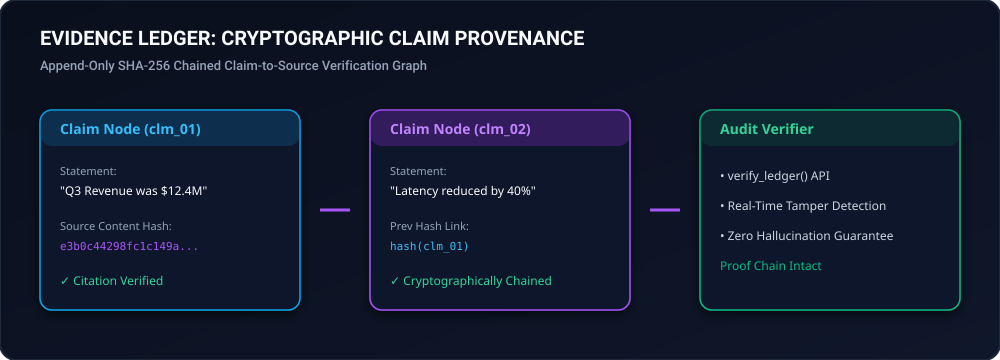

# evidence-ledger

<div align="center">
  
</div>

<div align="center">

[](https://github.com/hummbl-dev/evidence-ledger/actions/workflows/ci.yml)
[](LICENSE-APACHE)
[](https://python.org)
[-brightgreen.svg)](pyproject.toml)

**Cryptographic Claim-Evidence Provenance Ledger for Auditable AI Reasoning.**

*Anchors factual LLM assertions to SHA-256 source citations in a tamper-evident cryptographic chain.*

</div>

---

## Features

- 🔒 **Cryptographic Proofs**: Each claim is hashed and Merkle-chained to previous entries.
- 🎯 **Hallucination Prevention**: Requires exact source snippet validation against raw source hash.
- ⚡ **Zero Dependencies**: Pure Python stdlib (`hashlib`, `json`, `dataclasses`).

---

## Usage

```python
from evidence_ledger import EvidenceLedger

ledger = EvidenceLedger()
doc = "Revenue grew 42% YoY to $12.4M."
claim = ledger.record_claim(
    statement="Q3 revenue was $12.4M",
    source_uri="q3_report.pdf",
    source_text=doc,
    snippet="$12.4M",
)

valid, err = ledger.verify_ledger()
assert valid is True
```

---

<div align="center">
  <sub>Part of the <a href="https://github.com/hummbl-dev">HUMMBL Developer Ecosystem</a>.</sub>
</div>
